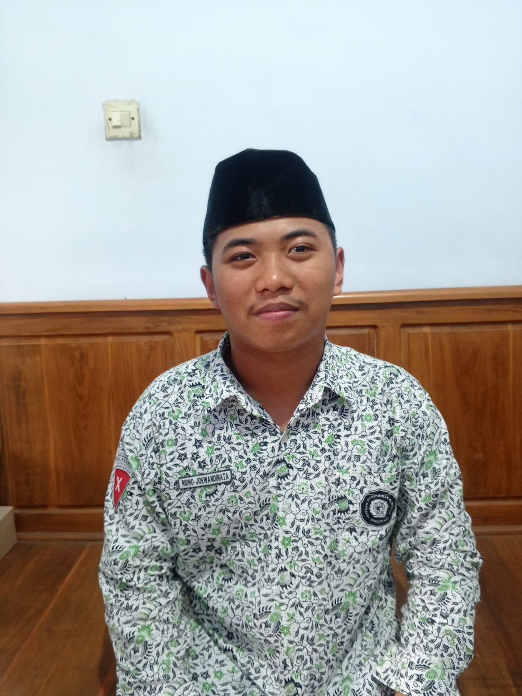

<!DOCTYPE html>
<html lang="id">
<head>
<meta charset="UTF-8">
<meta name="viewport" content="width=device-width, initial-scale=1.0">

<title>Profil Ridho Joewandilnata</title>

</head>

<body>

<header id="beranda">
    <h1>Ridho Joewandilnata</h1>
    
Website Profil Pribadi

</header>

<nav>
    <a href="#beranda">Beranda</a>
    <a href="#tentang">Tentang</a>
    <a href="#pendidikan">Pendidikan</a>
    <a href="#organisasi">Organisasi</a>
    <a href="#hobi">Hobi</a>
    <a href="#galeri">Galeri</a>
</nav>

<section id="tentang">

    

        <!-- FOTO PROFIL -->
        

        <h2>
            Halo, saya Ridho Joewandilnata 👋
        </h2>

        

            

                <b>Nama:</b>
                Ridho Joewandilnata
            

            

                <b>Tempat, tanggal lahir:</b>
                Trenggalek, 22 Januari 2010
            

            

                <b>Kelas:</b>
                XI 4
            

            

                <b>Sekolah:</b>
                MA Al-Ma'arif Singosari
            

        

    

</section>

<section id="pendidikan">

    <h2>🎓 Pendidikan</h2>

    

        <h3>MA Al-Ma'arif Singosari</h3>

        

            Kelas XI 4
        

    

</section>

<section id="organisasi">

    <h2>🤝 Organisasi</h2>

    

        

            PK IPNU MA Al-Ma'arif Singosari
        

    

    

        

            Pimpinan Anak Cabang IPNU Kecamatan Lawang
        

    

</section>

<section id="hobi">

    <h2>🎧 Hobi</h2>

    

        

            Mendengarkan musik 🎵
        

    

</section>

<section id="galeri">

    <h2>📸 Galeri Kegiatan</h2>

    

        <!-- FOTO KEGIATAN 1 -->
        

            

            

                Kegiatan 1
            

        

        <!-- FOTO KEGIATAN 2 -->
        

            

            

                Kegiatan 2
            

        

        <!-- FOTO KEGIATAN 3 -->
        

            

            

                Kegiatan 3
            

        

    

</section>

<footer>

    

        © 2026 Ridho Joewandilnata
    

</footer>

</body>
</html>
